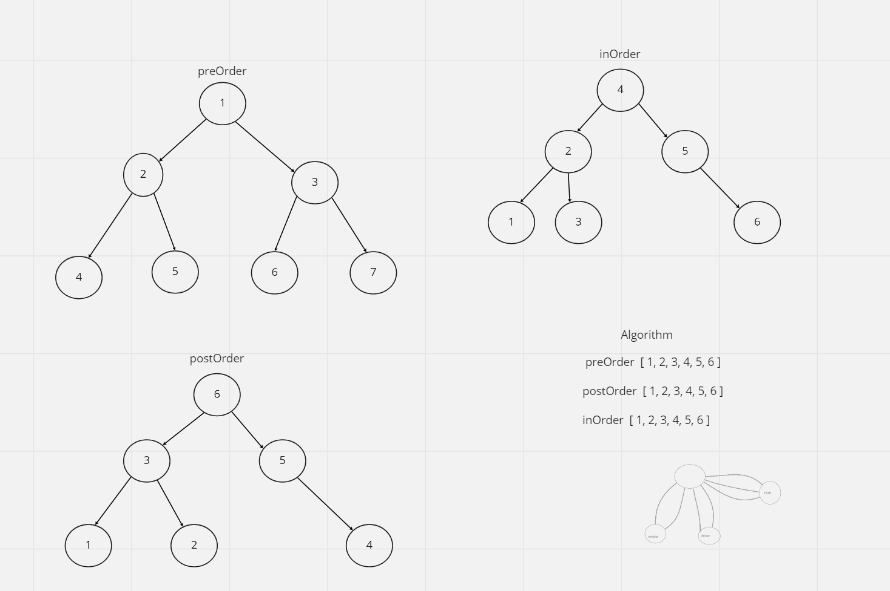
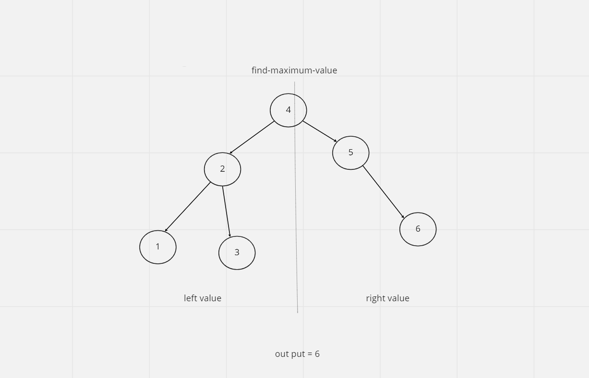

### TREES


### Challenge 16


- write a method called find-maximun-value that returns the maximum value  
stored in the tree.

``` maxValue ```

### Challenge 15


* To create a node class that has properties for the value stored in the node, the left child node, and the right child node.

The function should take a string as its only argument, and should return a boolean representing whether or not the brackets match.

type of methods to use:

- ``` preOrder ```

- ``` postOrder ```

-  ``` inOrder ```


Create a BinarySearchTree class


-  ``` contains ```

-  ``` add ```


### attribiution to:


- *Carly Dekock*
- *Jason D*
- *Jason Q*


- UML

- 

- 